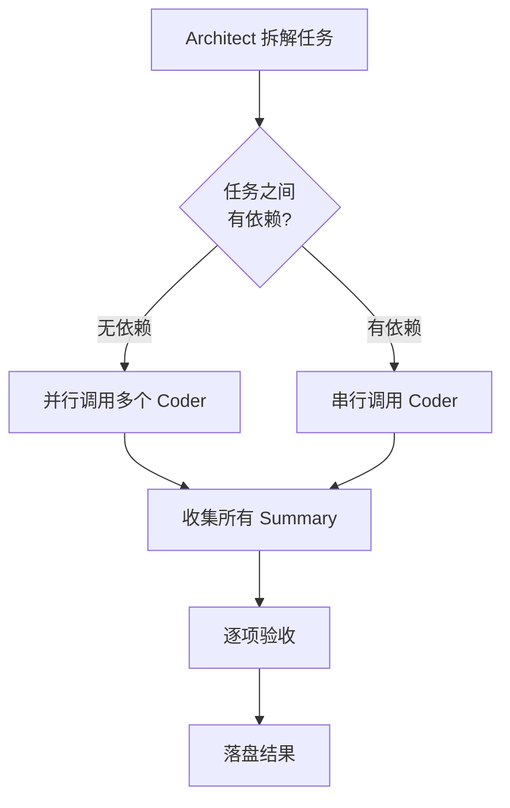

# Thinker + Executor 模式深度解析

> 本文是 [README.md](README.md) 的扩展，深入讨论设计原理、边界情况、高级用法。

---

## 目录

1. [问题起源](#问题起源)
2. [模式设计](#模式设计)
3. [任务包设计哲学](#任务包设计哲学)
4. [Summary 验收系统](#summary-验收系统)
5. [并行与串行调度](#并行与串行调度)
6. [上下文隔离与手递](#上下文隔离与手递)
7. [失败处理](#失败处理)
8. [模式边界](#模式边界)
9. [从模式到平台](#从模式到平台)

---

## 问题起源

### LLM 编码的行为倾向

Andrej Karpathy 观察到 LLM 在编码时有以下倾向：

1. **默认假设** — 不确认就替你做决定
2. **隐藏困惑** — 不理解也不说
3. **过度设计** — 200 行能搞定的写成 1000 行
4. **顺手改** — 改不相关的代码

### 为什么单 Agent 会放大这些问题

```
单 Agent 流程：
  用户请求 → Agent 同时思考 + 执行 → 输出
  问题：思考不够 → 执行随意 → 出错 → 再改
```

当同一个模型同时负责"想"和"干"时：

- **思考阶段不够专注**：想着要执行，分析草草了事
- **执行阶段带偏见**：之前分析的假设被带进执行
- **纠错成本高**：发现错了 → 重新思考 → 重新执行 → 可能再错

### 拆分后的改进

```
Thinker + Executor 流程：
  用户请求 → Architect 专注思考 → 任务包 → Coder 专注执行 → Summary → 验收
  改进：思考深 → 指令准 → 执行快 → 验收严
```

---

## 模式设计

### 角色三角

```
              Architect
             （思考者）
              /        \
             /          \
            /            \
    Finder（侦察兵）  Coder（执行者）
```

三个角色构成一个协作三角：

- **Architect** 是大脑，不碰代码，只做决策
- **Finder** 是眼睛，不分析代码，只找位置
- **Coder** 是手，不做决策，只改代码

### 为什么是三角而不是直线

直线流程（Architect → Coder）的问题是：Architect 在"盲写"任务包。

它不知道项目结构、不知道哪些文件存在、不知道代码风格。加上 Finder 后，Architect 先了解现场，再下指令。

**规则：**

```
需要了解代码结构？
├── 是 → 调用 Finder → 拿到结构 → 生成任务包 → 调用 Coder
└── 否（你已告知/项目很小）→ 直接生成任务包 → 调用 Coder
```

### 角色权限设计

| 角色 | Read | Write | Execute | Task |
|------|------|-------|---------|------|
| Architect | ✅ | ask | ask | ✅ |
| Coder | ✅ | ✅ | ✅ | ❌ |
| Finder | ✅ | ❌ | ❌ | ❌ |

权限设计原则：
- **最小权限**：每个角色只拥有完成职责所必须的权限
- **降级路径**：Architect 保留 write（ask），紧急情况可自己动手
- **单向调用**：Coder 不能调 Architect，避免循环

---

## 任务包设计哲学

### 为什么任务包要"不动脑"

任务包的目标是消除 Coder 的决策空间。每一个决策都应该是 Architect 做好的。

**反面例子（太模糊）：**

```markdown
## 任务包

### 目标
优化 GPIO 初始化函数
```

这种任务包的问题：Coder 要自己决定"怎么优化"、"优化到什么程度"。这就把决策权交给了执行者。

**正面例子（精确）：**

```markdown
## 任务包

### 定位
- **目标文件**: src/gpio.c
- **修改区域**: GPIO_Init() 第 32-68 行
- **上下文**: STM32F407, HAL 库

### 分析
- **现状**: 每个引脚单独调用 HAL_GPIO_Init()，共 8 次调用
- **约束**: 引脚顺序不能变，PLL 配置不能动

### 目标
- **期望结果**: 8 次独立 HAL_GPIO_Init() 调用合并为 1 次批量调用
- **验收标准**: 编译通过 + 寄存器值不变
```

### 任务包的三个部分

| 部分 | 作用 | 必须？ |
|------|------|--------|
| **定位** | 告诉 Coder "在哪里改" | ✅ |
| **分析** | 告诉 Coder "为什么改"和"不能碰什么" | ✅ |
| **目标** | 告诉 Coder "改成什么样"和"怎么验证" | ✅ |

### 任务包的粒度

**太粗：** 一个任务包包含 5 个文件的改动
→ Coder 容易遗漏、改错

**太细：** 每个函数一个任务包
→ 调度开销太大

**合适的粒度：** 一个文件、一个功能模块、一个验证点

```
✅ 好的粒度：
  - "修改 auth.py 的 login()，移除日志中的密码"
  - "在 gpio.c 中新增 GPIO_Toggle() 函数"
  - "重构 config.h 中的宏定义，统一命名风格"

❌ 太粗：
  - "重构整个认证模块"
  
❌ 太细：
  - "把 auth.py 第 12 行的 password 改为 pwd"
  （这不需要任务包，直接告诉 Coder 改就行）
```

---

## Summary 验收系统

### 为什么必须验收

没有验收的任务分发是危险的。Coder 可能：
- 只完成了部分目标
- 改了不该改的东西
- 验证作假（说编译通过实际没编译）

### 验收流程

```
Coder 提交 Summary
       ↓
Architect 逐项检查：
  [ ] 目标是否全部完成？
  [ ] 变更文件是否在范围内？
  [ ] 有没有超出范围的改动？
  [ ] 验证结果可信吗？
       ↓
  全部通过 → 接受 → 落盘结果
  部分失败 → 生成修正任务包 → 再调 Coder
  超范围   → 拒绝 → 回滚 → 警示
```

### Summary 反模式

```markdown
❌ 不合格的 Summary：
## Summary
搞定了。

❌ 缺乏验证：
## Summary
改了 gpio.c，应该没问题。

✅ 合格的 Summary：
## Summary
### 完成内容
- GPIO_Init() 中 8 次独立调用合并为 1 次 HAL_GPIO_Init() 批量调用

### 变更文件
- `src/gpio.c`: GPIO_Init() 函数精简为批量初始化

### 验证结果
- [x] 编译通过 (arm-none-eabi-gcc -c gpio.c)
- [x] 寄存器值对比：批量初始化前后 MODER/OTYPER 一致

### 遗留问题
- 无
```

---

## 并行与串行调度

### 何时并行

当多个子任务满足以下条件时可并行：

1. **操作不同文件** — 互不冲突
2. **无逻辑依赖** — 任务 A 的结果不决定任务 B 怎么做
3. **Architect 可以独立验收** — 不需要等某个 Coder 完成后才能判断

### 并行示例

```
用户：重构项目，把 src/ 下所有函数名从 camelCase 改为 snake_case

Architect 拆解：
  任务包 A：src/auth.c 中的函数命名
  任务包 B：src/utils.c 中的函数命名
  任务包 C：src/db.c 中的函数命名

调度：Coder A、B、C 同时启动
```

### 串行示例

```
用户：先创建一个头文件，然后在 .c 中实现

Architect 拆解：
  任务包 A：创建 include/calc.h，定义 int add(int, int)
  任务包 B：创建 src/calc.c，实现头文件中的函数

调度：先 A 后 B（B 依赖 A 中定义的头文件）
```

### 调度流程



---

## 上下文隔离与手递

### 为什么需要上下文隔离

LLM Agent 的上下文窗口是有限的。如果把所有分析、决策、执行日志塞在一个上下文中：

1. **上下文快速耗尽** → 触发压缩 → 丢失关键信息
2. **角色混乱** → Coder 看到 Architect 的思考过程 → 被影响判断
3. **缓存效率低** → 混合内容不利于缓存命中

### 手递机制

```
Architect 上下文           Coder 上下文
┌──────────────┐         ┌──────────────┐
│ 用户请求      │         │               │
│ 项目分析      │  任务包  │  任务包       │
│ Finder 结果   │ ──────→ │  目标文件内容  │
│ 决策过程      │         │  改动         │
│               │  Summary│  验证         │
│ 验收          │ ←────── │  Summary     │
│ 汇总结果      │         │               │
└──────────────┘         └──────────────┘
```

关键：
- Coder **只看**任务包和目标文件，不看 Architect 的思考过程
- Architect **只看** Summary，不看 Coder 的执行细节
- 信息通过**结构化的任务包和 Summary** 传递，不通过"你懂的"模糊传递

### 缓存优势

在支持 Prompt Caching 的平台上（如 DeepSeek、Anthropic）：

- **Architect 上下文**：系统 Prompt + 项目背景 → 缓存
- **Coder 上下文**：系统 Prompt → 缓存（不含项目背景，复用率高）

两个上下文隔离 → 各自缓存命中率高 → 更快、更便宜。

---

## 失败处理

### Coder 执行失败

```
Coder 提交 Summary（包含失败信息）
       ↓
Architect 分析失败原因：
  ├── 任务包有误 → 修正任务包 → 重新调用 Coder
  ├── Coder 能力不足 → 自己动手（紧急可动）
  └── 环境问题 → 告知用户
```

### Finder 扫描不充分

```
Finder 返回结果不完整
       ↓
Architect 补发更具体的扫描指令
  或
Architect 基于不完整信息生成任务包 → Coder 执行 → Summary 显示遗漏
       ↓
Architect 生成补充任务包
```

### Architect 自己卡住

```
Architect 无法拆解任务
       ↓
Architect 向用户提问：
  "我的理解是 XXX，但我需要确认 YYY"
  "这个任务我有两种拆法，你倾向哪种？"
```

---

## 模式边界

### 不适合的场景

| 场景 | 原因 |
|------|------|
| 单文件小改动 | 拆解开销大于执行 |
| 知识问答 | 不需要执行 |
| 需要连续上下文 | Coder 每次都是独立上下文 |
| 实时反馈循环 | 架构太重，用单 Agent 更快 |
| 架构探索 | 先 Plan 讨论，模式本身是执行框架 |

### 简化变体

```
完整版：Architect → Finder → Coder(s) → 验收
精简版：Architect → Coder（已知项目结构）
极简版：单 Agent + 任务包格式（没有多 Agent 的平台）
```

---

## 从模式到平台

### 平台适配矩阵

| 平台 | Architect 实现 | Coder 实现 | Finder 实现 | 通信方式 |
|------|---------------|-----------|------------|---------|
| **OpenCode** | Primary Agent | Subagent | Subagent | Task 工具 |
| **Claude Code** | 主会话 | `.claude/agents/` | Subagent | Task/CLI |
| **Cursor** | Custom Rule | Custom Rule | Custom Rule | 手动切换 |
| **Aider** | 架构文件 | `/architect` 模式 | 手动扫描 | 命令切换 |
| **自定义** | 主 LLM 调用 | 单独的 API 调用 | 单独的 API 调用 | API |

关键适配点：
1. 平台是否支持 Agent 调用 Agent？
2. 如何实现上下文隔离？
3. 任务包如何传递？

详见 [implementations/](implementations/) 目录中每个平台的具体实现。

---

## 参考资料

- [Andrej Karpathy on LLM Coding Pitfalls](https://x.com/karpathy/status/2015883857489522876)
- [andrej-karpathy-skills](https://github.com/forrestchang/andrej-karpathy-skills) — Karpathy 原则的 CLAUDE.md 实现
- [OpenCode Agents 文档](https://opencode.ai/docs/agents/)
- [Claude Code Subagents 文档](https://docs.anthropic.com/en/docs/claude-code/sub-agents)
