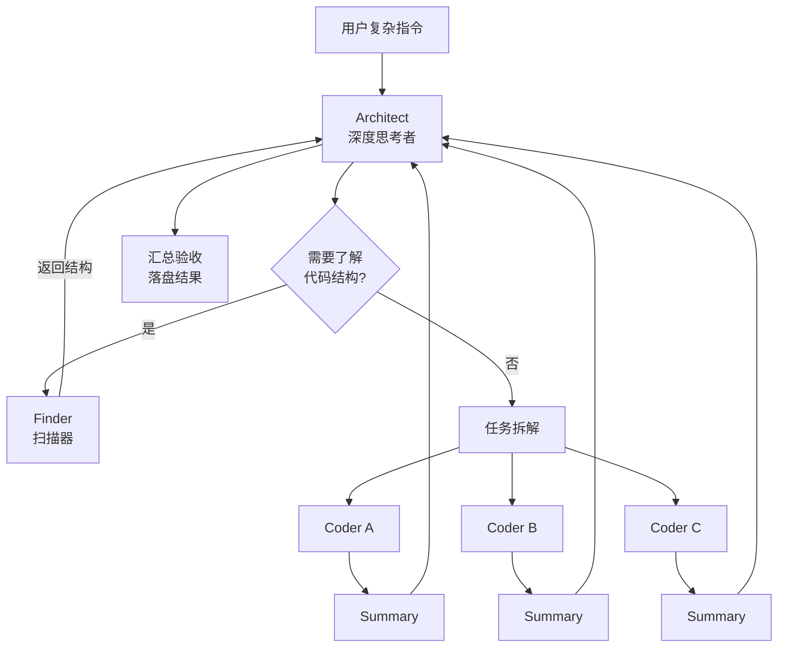

# Deepseek-Cheaper
# Thinker + Executor：Agent 协作模式

> **让贵的模型想，让便宜的模型干。**
>
> 一种将"深度思考"与"快速执行"分离的 LLM Agent 协作模式。适用于 OpenCode、Claude Code、Cursor 等任何支持多 Agent 的编码平台。

[](LICENSE)

---

## 目录

- [一句话说清楚](#一句话说清楚)
- [为什么需要这个模式](#为什么需要这个模式)
- [核心架构](#核心架构)
- [任务包：Agent 之间的通信协议](#任务包agent-之间的通信协议)
- [Summary：验收的唯一依据](#summary验收的唯一依据)
- [关键原则](#关键原则)
- [各平台实现](#各平台实现)
- [实战测试](#实战测试)
- [自定义指南](#自定义指南)
- [FAQ](#faq)

---

## 概括

```
一个深度思考者（Architect）拆解任务 → 生成精准任务包
                                    ↓
                  一个或多个执行者（Coder）并行执行
                                    ↓
                  所有结果汇总回思考者验收
```

**类比：** 建筑设计师画好施工图，工人按图施工。设计师不砌墙，工人不设计。

---

## 为什么需要这个模式

### 单 Agent 的三个问题

| 问题 | 表现 | 后果 |
|------|------|------|
| **角色混乱** | 同一个模型既要分析又要执行 | 分析不够深、执行不专注 |
| **成本浪费** | 简单操作也要用昂贵模型 | 创建一个文件也消耗同样的推理成本 |
| **来回摇摆** | 执行中发现新问题 → 中断执行 → 重新分析 → 再执行 | 效率低，容易出错 |

### 这个模式怎么解决

| 单 Agent | Thinker + Executor |
|----------|-------------------|
| 1 个模型做所有事 | **Architect** 专注思考、**Coder** 专注执行 |
| 同样成本处理简单任务 | **Flash 模型执行**，Pro 模型只思考 |
| 执行与分析互相干扰 | **上下文隔离**，各司其职 |
| 串行执行 | **多个 Coder 并行**执行独立子任务 |

### 灵感来源

这套模式受 Andrej Karpathy 对 LLM 编码行为的观察启发：

> "模型会替你做错误假设然后一路跑下去。它们不会管理自己的困惑，不寻求澄清，不揭示不一致，不呈现权衡，不该妥协的时候不推回去。"

**思考者（Architect）** 的存在就是为了解决这些问题——它负责质疑、澄清、推回，然后才分发任务。

---

## 核心架构

### 角色定义

| 角色 | 模型建议 | 职责 | 权限 |
|------|---------|------|------|
| **Architect** | Pro（昂贵、强大） | 分析需求、拆解任务、验收结果 | 只读 + 可紧急动手 |
| **Finder** | Flash（便宜、快速） | 扫描代码结构、返回定位信息 | **只读** |
| **Coder** | Flash（便宜、快速） | 接收任务包、执行改动、提交 Summary | 完整执行权 |

### 工作流



### 为什么拆出 Finder

Finder 解决 Architect 的"盲人摸象"问题。Architect 不知道项目结构时，先派 Finder 侦察，拿到精准上下文再做决策。

**注意：** 如果项目很小或你已明确告知结构，可以跳过 Finder 直接拆解任务。

---

## 任务包：Agent 之间的通信协议

任务包是 Architect 和 Coder 之间的唯一接口。**任务包必须让 Coder 不动脑子就能执行。**

### 格式

```markdown
## 任务包

### 定位
- **目标文件**: src/gpio.c
- **修改区域**: GPIO_Init() 函数 (第 32-68 行)
- **上下文**: STM32F4 HAL 库，当前使用了 PB0 引脚

### 分析
- **现状**: 当前配置为推挽输出模式
- **约束**: 不能改动 PB1 的配置（用于 UART），时钟配置不能动
- **风险**: 改为开漏后需要确认外部上拉电阻

### 目标
- **期望结果**: GPIOB_Pin0 从推挽输出改为开漏输出
- **验收标准**: 寄存器 MODER=01, OTYPER=1
```

### 设计原则

| 原则 | 说明 |
|------|------|
| **单一职责** | 每个任务包只做一件事 |
| **精准定位** | 文件路径 + 行号 + 函数名 |
| **明确约束** | 说清楚什么不能动 |
| **可验证目标** | 有客观的验收标准 |

### 任务包示例

```markdown
## 任务包

### 定位
- **目标文件**: D:\project\src\auth.py
- **修改区域**: login() 函数
- **上下文**: Flask 项目，使用 JWT 认证

### 分析
- **现状**: 密码明文存储在日志中
- **约束**: 不能改动 token 生成逻辑
- **风险**: 修改后需确认日志轮转不受影响

### 目标
- **期望结果**: 移除日志中的密码字段，替换为 `[REDACTED]`
- **验收标准**: grep "password" app.log 无明文密码输出
```

---

## Summary：验收的唯一依据

Coder 完成任务后**必须**提交 Summary。Architect 只根据 Summary 验收。

### 格式

```markdown
## Summary

### 完成内容
- 将 GPIO_Init() 中 PB0 从推挽输出改为开漏输出

### 变更文件
- `src/gpio.c`: 修改 GPIO_Init() 第 45 行，OTYPER |= GPIO_OTYPER_OT0

### 验证结果
- [x] 编译通过 (gcc -c gpio.c)
- [x] 寄存器配置正确 (MODER=01, OTYPER=1)

### 遗留问题
- 无
```

### 验收清单

Architect 收到的每个 Summary 必须通过以下检查：

- [ ] 所有任务包目标是否都有对应的完成内容？
- [ ] 变更文件是否都在任务包指定范围内？
- [ ] 是否有超出范围的改动？（**不允许**）
- [ ] 验证结果是否可信？
- [ ] 遗留问题是否需要跟进？

---

## 关键原则

### Architect 守则

| # | 原则 | 说明 |
|---|------|------|
| 1 | **默认分发** | 能交给 Coder 的就不要自己动手 |
| 2 | **任务明确** | 任务包必须让 Coder 不用思考就能执行 |
| 3 | **严格验收** | 超出范围的改动必须拒绝 |
| 4 | **紧急可动** | 保留动手能力，但作为最后手段 |

### Coder 守则

| # | 原则 | 说明 |
|---|------|------|
| 1 | **不思考** | 不做决策、不搞设计、不问为什么 |
| 2 | **不越界** | 只动任务包指定的范围 |
| 3 | **不重构** | 不要"顺手"改其他代码 |
| 4 | **必提交 Summary** | 这是 Architect 验收的唯一依据 |

### Finder 守则

| # | 原则 | 说明 |
|---|------|------|
| 1 | **只读** | 不修改任何文件 |
| 2 | **快速** | 扫结构，不深入分析 |
| 3 | **结构化输出** | 返回格式化的定位信息 |
| 4 | **不做决策** | 只提供信息，不给建议 |

---

## 各平台实现

不同平台的实现方式不同，但核心模式一致：

| 平台 | 实现方式 | 文档 |
|------|---------|------|
| **OpenCode** | Primary Agent + Subagent（Task 工具调用） | [→](implementations/opencode.md) |
| **Claude Code** | CLAUDE.md 配置 + Subagent 模式 | [→](implementations/claude-code.md) |
| **Cursor** | Custom Agent Rules + 手动切换 | [→](implementations/cursor.md) |

核心区别在于各平台如何实现"Agent 调用 Agent"：

- **OpenCode**: `mode: subagent`，Primary 用 Task 工具调用
- **Claude Code**: `.claude/agents/` 目录，CLI 或 Task 工具调用
- **Cursor**: `.cursor/rules/` 定义 Agent，依赖手动切换或 `.cursor/commands`

---

## 实战测试

用以下测试用例验证模式是否跑通：

### 测试指令

```
帮我扫描一下当前目录的代码结构，然后创建一个 calc.c 文件，
实现一个 add 函数，能算两个 int 的和。
```

### 预期流程

```
[1] Architect 分析需求
[2] 调用 Finder 扫描目录 → 确认无冲突
[3] 生成任务包（定位 + 分析 + 目标）
[4] 调用 Coder 执行
[5] Coder 创建文件 → 自测验证 → 提交 Summary
[6] Architect 逐项验收
```

### 验收标准

| # | 标准 | 期望结果 |
|---|------|---------|
| 1 | 文件创建 | `calc.c` 存在 |
| 2 | 函数正确 | `int add(int a, int b) { return a + b; }` |
| 3 | 编译通过 | `gcc -c calc.c` 无错误 |
| 4 | Summary 完整 | 包含完成内容、变更文件、验证结果 |
| 5 | 未越界 | 未修改其他文件 |

---

## 自定义指南

### 换模型

不同平台支持的模型不同。关键是保持"思考者用贵的，执行者用便宜的"原则：

| 角色 | 推荐模型 | 备选模型 |
|------|---------|---------|
| Architect | GPT-5 / Claude Opus / DeepSeek V4 Pro / Gemini 3 Pro | 任何强大的推理模型 |
| Coder | GPT-5 Mini / Claude Haiku / DeepSeek V4 Flash / Gemini Flash | 任何快速的编码模型 |
| Finder | 同 Coder | 更便宜的模型也可 |

### 加新角色

模式本身是开放的，可以根据需求加入新角色：

| 新增角色 | 职责 | 何时加 |
|---------|------|--------|
| **Reviewer** | 审查 Coder 的代码质量 | 项目对质量要求高 |
| **Tester** | 专门写测试、跑测试 | 需要自动化测试流程 |
| **Docer** | 生成/更新文档 | 需要自动维护文档 |

### 调温度

| 角色 | 推荐温度 | 原因 |
|------|---------|------|
| Architect | 0.3 | 分析需要输出稳定、一致 |
| Coder | 0.2 | 执行需要精确、不玩花样 |
| Finder | 0.1 | 扫描需要确定、不遗漏 |

---

## FAQ

### Q: 这个模式是不是把简单事搞复杂了？

**简单的任务不需要这个模式。** 创建单个文件、问个问题、小修小补——直接用一个 Agent 就行。

这个模式适合：
- 多文件改动
- 需要先了解项目结构
- 多个独立子任务可以并行
- 涉及架构级决策

### Q: 任务包必须这么严格吗？

初期可以宽松。但经验表明：**任务包越明确，Coder 越少犯错。** 模糊的任务包会导致 Coder 猜着干，然后 Architect 花更多时间纠错。

### Q: Finder 什么时候可以跳过？

- 你已经明确告诉了目标文件和位置
- 项目很小（< 10 个文件）
- 你已经在之前的对话中提供了足够上下文

### Q: 多个 Coder 会不会冲突？

Architect 在拆解任务时应该保证子任务之间互不冲突（操作不同的文件或不同的函数）。如果确有依赖，串行执行。

### Q: 我只有一个模型怎么办？

模式仍然有效。同一个模型在不同 Agent 中扮演不同角色，关键是**上下文隔离**和**职责分离**。即使模型相同，专注的角色比混合角色效果好。

---

## 许可证

MIT © 2025

---

## 贡献

欢迎提 Issue 讨论模式改进、新平台实现、最佳实践。

如果你在某个平台成功应用了这个模式，欢迎提交 PR 添加实现文档。

---

**这些准则生效的标志：** Coder 的输出精准、Architect 的验收可以全自动完成、用户很少需要介入微观执行。
